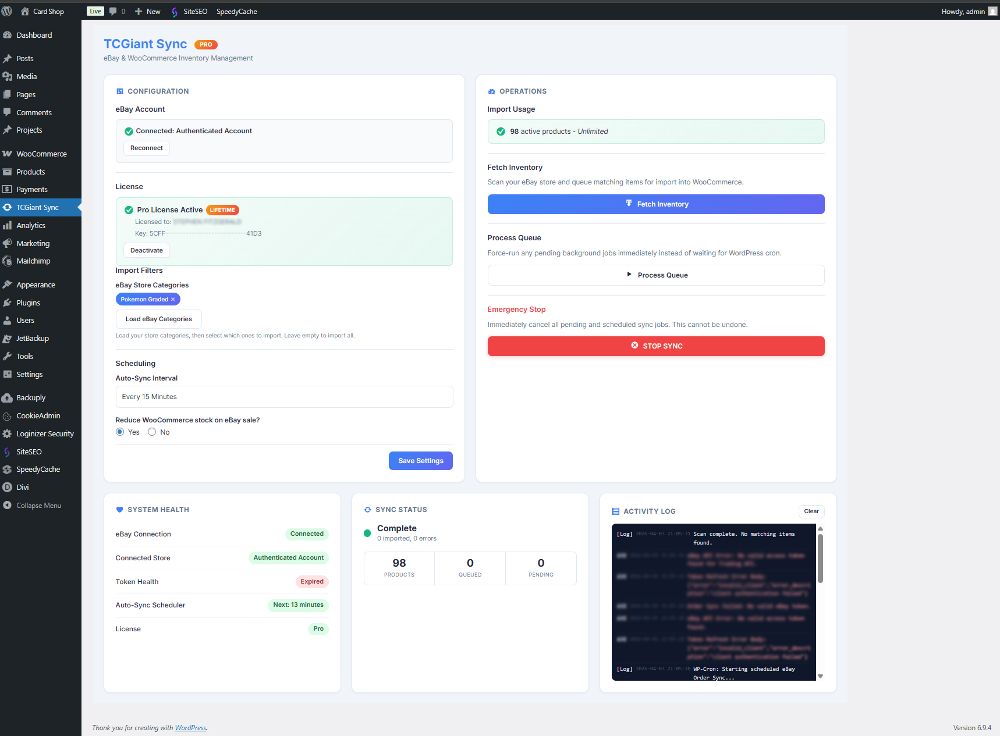
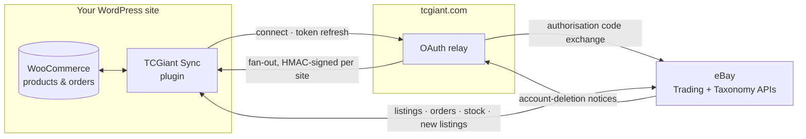
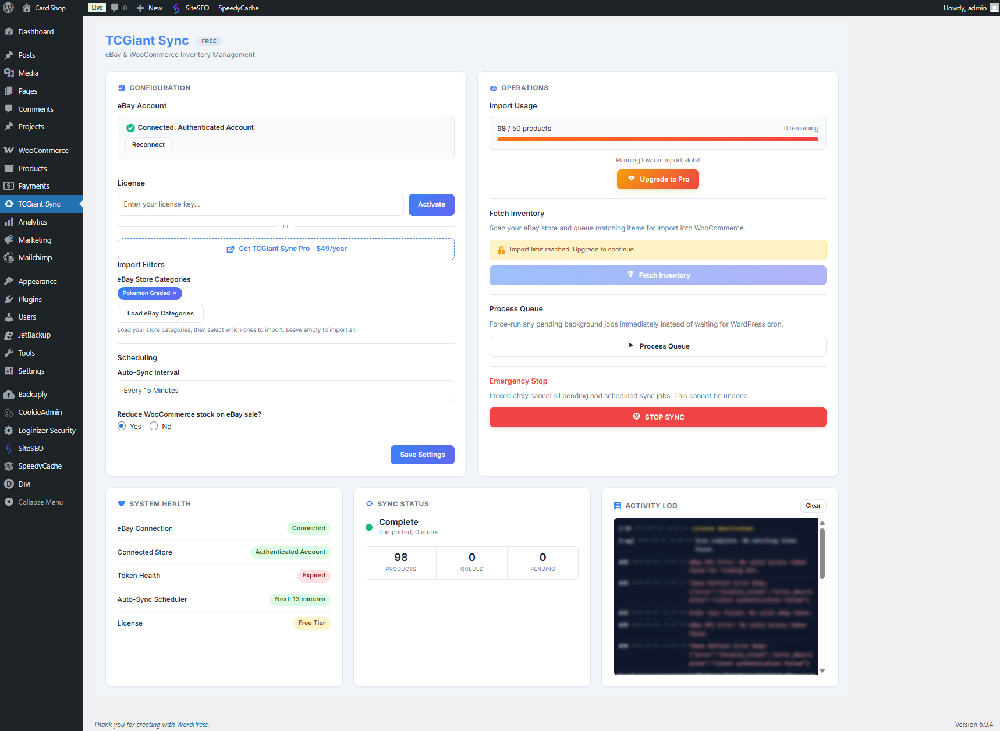

  

# TCGiant Sync

**Two-way eBay ↔ WooCommerce sync that keeps one catalogue honest across both — built for card and coin sellers, and works for anyone.**

  

---

## What is TCGiant Sync?

A WordPress plugin that connects a WooCommerce shop to an eBay seller account and keeps the two in step, in both directions:

- **Import** your eBay listings into WooCommerce — titles, descriptions, images, item specifics, weight and size, categories — and keep them current on a schedule.
- **Push** WooCommerce products to eBay as live listings, with eBay's own category tree, business policies, and condition vocabulary — including the graded/ungraded descriptors that trading-card and coin categories require.
- **Reconcile stock** whichever side sells: a sale on eBay reduces WooCommerce; a sale on your site updates eBay; a listing that ends without selling settles the quantity rather than zeroing it.

It grew up serving trading-card and coin shops, and that shows in what it knows: PSA, BGS, CGC and SGC grading, eBay's Graded/Ungraded condition IDs, coin condition ladders. But the machinery underneath is general — an **"All Other"** item type lists electronics, parts, clothing or anything else with plain conditions and no grading.

## Why TCGiant Sync?

Selling the same stock in two places means keeping two catalogues in agreement, and by hand that never lasts. The specific ways it fails are the ones this plugin is built around:

- **Overselling.** An item sells on eBay at 2 a.m. and is still for sale on your site at 9. Or a listing *ends without selling* and a naive sync zeroes the stock you still hold. Both directions are handled, and ended-unsold is treated differently from sold-out.
- **Drift you don't see.** A scheduled delta sync only asks eBay what changed in the last 48 hours; a site that was unreachable for a day never hears about a listing that ended in that window. A weekly full scan walks the whole account so nothing stays stale for long.
- **eBay's vocabulary.** Category IDs, condition IDs that mean different things in different categories, required item specifics, business policies. The plugin speaks it so you don't have to — and tells you *before* contacting eBay when a required field is empty.
- **Units and marketplaces.** A listing on eBay UK is metric and a listing on eBay US is not. The plugin reads the measurement system from each listing itself, so a 0.6 kg part stays 0.6 kg.
- **Nothing to run.** No cron server, no middleware, no bring-your-own eBay developer keys. Connect once with eBay's OAuth and the plugin does the rest on WordPress's own scheduler.

## Features

### Import — eBay → WooCommerce

| | |
|---|---|
| Import active listings, with images localised to your media library | ✅ |
| Automatic product mapping: attributes from item specifics, categories, variations | ✅ |
| eBay store-category and standard-category filters — import only what you want | ✅ |
| Scheduled delta sync (15 min / hourly / twice daily / daily) plus a weekly full scan | ✅ |
| Ended-listing detection every hour, with **ended-unsold ≠ sold-out** stock handling | ✅ |
| Weight and dimensions, in the right units for the listing's marketplace | ✅ |
| Data-mapping rules on re-import (which side wins for title, price, images, …) | ✅ |
| Bake eBay shipping cost into the product price | ✅ |
| Map eBay SKU to a Bin Location field | ✅ |
| Prune sold-out and ended listings from WooCommerce, with a preserve-list | ✅ |
| Stock Review and Image Cleanup screens for bulk settlement | ✅ |

### Push — WooCommerce → eBay

| | |
|---|---|
| Unified **eBay Listing** tab on every product: Item Type → Category → Condition → Push | ✅ |
| Single push, bulk push from the Products list, and background processing via Action Scheduler | ✅ |
| Smart update detection — revises an existing listing rather than creating a duplicate | ✅ |
| Category auto-suggestion from the product title, plus an interactive category browser | ✅ |
| Item specifics from WooCommerce attributes, canonicalised against eBay's aspect names | ✅ |
| **Pre-push check** that names any required item specific that is empty | ✅ |
| Condition descriptors for Trading Cards and Coins (Graded with grader/grade/cert, or Ungraded) | ✅ |
| **"All Other"** item type for non-collectibles, with eBay's plain condition list | ✅ |
| Package weight and dimensions, converted to the listing site's system (optional) | ✅ |
| Per-product listing type (Fixed Price / Auction), duration, shipping policy, category, condition | ✅ |
| Business Policies (shipping, returns, payment) fetched in one click | ✅ |
| Order import and tracking push back to eBay | ✅ |

### Everywhere

- **OAuth 2.0** through a hosted relay — you never handle eBay developer credentials, and the plugin never stores them.
- **Live dashboard** with connection health, sync status, and an activity log that says what happened and why.
- **Connection test** that distinguishes "our host is refusing you" from "your network intercepts everything" — the difference between a rule your host can lift and one they can't.
- **Marketplaces:** US, UK, Canada, Australia, Germany, France, Italy, Spain.

### Free and Pro

The free tier imports up to 50 active products; **Pro** removes the cap and adds priority support. Push to eBay is not limited in either. → [tcgiant.com/pro](https://tcgiant.com/pro/)

## Demo

**Website and Pro:** https://tcgiant.com/pro/

A recorded walkthrough of a full import and a push is on the roadmap; the screenshots below are from a live shop.

## How It Works

The relay exists for one reason: eBay's OAuth requires an application secret, and that secret must never sit inside a plugin distributed to thousands of sites. So the relay holds it, performs the code exchange and token refresh, and hands each site its own signing key. **Everything else — every listing fetched, every product pushed, every stock update — goes directly from your site to eBay** with your site's own token.

**What runs when**

| Trigger | What happens |
|---|---|
| You press *Fetch Inventory* | Full scan of the eBay account, 200 listings per page, self-chaining through WP-Cron so a large store finishes across many requests |
| Every sync interval | Delta: eBay is asked what changed in the last 48 h; changed listings are re-mapped, new ones imported (within the free cap), sold-out ones removed if you've asked |
| Every hour | Ended-listing check: stock settled from the listing's *listed − sold*, so an unsold end keeps your goods in stock |
| Weekly | Full scan, to catch anything a delta could not see |
| An order on your site | Stock pushed to eBay for every line item that tracks stock; listing ended at zero if you've asked |
| A push | Product validated locally (category, condition, policies, required item specifics) before eBay is contacted; then queued and listed in the background |

## Quick Start

**Requirements:** WordPress 5.8+, PHP 7.4+, WooCommerce 5.0+, an eBay seller account. Push to eBay needs [Business Policies](https://bizpolicy.ebay.com) enabled on the seller account (most are).

1. **Install** — download `tcgiant-sync-<version>.zip` from the [latest release](https://github.com/SurefireStudios/TCGiant-Sync/releases/latest), then *Plugins → Add New → Upload Plugin → Activate*.
2. **Connect** — *TCGiant Sync → Settings → Connect to eBay*, and approve in eBay's window. The setup wizard asks for your marketplace; if you skip it, the plugin takes the marketplace from your first imported listing.
3. **Import** — *TCGiant Sync → Import → Fetch Inventory*. Optionally narrow by store category first. Set a sync interval in Settings when you're happy.
4. **Push** — in Settings, set a default category and *Fetch Policies*. Then open any product → *eBay Listing* tab → Item Type → Category → Condition → **Push**. The checklist tells you what's missing before eBay does.

Updates arrive through WordPress's normal update screen.

## Architecture

**Stack:** PHP 7.4+, WordPress, WooCommerce, Action Scheduler (background jobs), eBay Trading API (XML) for listings/orders/stock and eBay Taxonomy API (REST) for categories and aspects, WP-Cron for scheduling. The relay is a small PHP + SQLite service.

**Key classes** — all under `includes/`, autoloaded by name:

| Class | Role |
|---|---|
| `TCGiant_Sync_OAuth` | Connect, token refresh via the relay, the connection test |
| `TCGiant_Sync_API` | Trading + Taxonomy calls, retry, rate limiting, the daily call budget |
| `TCGiant_Sync_Importer` | Full and delta scans, page walking, pruning, the free-tier gate |
| `TCGiant_Sync_Mapper` | eBay item → WooCommerce product: attributes, variations, units, images |
| `TCGiant_Sync_Exporter` | WooCommerce product → eBay listing XML, condition descriptors, package details |
| `TCGiant_Sync_Inventory` | Stock in both directions; the ended-listing settlement rule |
| `TCGiant_Sync_Catalog` | The eBay vocabulary the screens show: categories, conditions, graders, grades |
| `TCGiant_Sync_Listing_Link` | Keeps a product's eBay link honest when products are duplicated |
| `TCGiant_Sync_Entitlements` | "May another product be imported?" — the licence extends it |
| `TCGiant_Sync_Cron` | Scheduling and the background-dispatch plumbing |
| `TCGiant_Sync_Image_Localizer` | Background image download, with a guard against re-importing a shop's own photos |
| `TCGiant_Sync_Jobs` | The bulk-job runner behind bulk push, verify, settle and cleanup |
| `TCGiant_Sync_Webhooks` | eBay account-deletion endpoint, verified against the per-site signing key |

**A design rule worth knowing:** the source tree *is* the Pro edition. Lite (WordPress.org) and Standard (WooCommerce.com) editions are being built from this same tree by leaving files out, never by forking it — so every fix lands once. The classes above are shaped by that: what every edition needs lives in files every edition ships.

**Safety nets in the repo** — `tools/`:

- `check-hooks.php` records every hook registration and fails if one goes missing. A lost stock-sync hook produces no error; stock just stops flowing. This is the only thing that would notice.
- `check-formats.php` runs every translatable format string through `sprintf`, because a stray backslash in one once took a site down.
- `check-archive-parity.php` confirms that what auto-updating sites receive and what the uploaded zip contains are the same files.
- `check-version.php`, `check-views.php`, `check-tabs.php`, `check-limit-gates.php` — see [`tools/README.md`](tools/README.md).

## Screenshots

| | |
|---|---|
|  |  |
| Dashboard: connection health, sync status, activity | Import: category filters, usage, live progress |

## Use Cases

- **A card shop that lives on eBay** and wants its website to mirror the eBay inventory without retyping anything — imports, then scheduled syncs keep it honest.
- **A shop that lives on WooCommerce** and wants its catalogue on eBay too — push, with eBay's categories suggested from titles and required specifics named before you submit.
- **Graded stock.** PSA 10s, CGC 9.8s, slabbed coins — the condition descriptors eBay requires for those categories, from a dropdown rather than a spec sheet.
- **Not cards at all.** Networking gear, car parts, clothing: the *All Other* item type, plain conditions, package weight for calculated postage.
- **Outside the US.** UK, EU and Australian sellers get metric in and metric out, and push to the right eBay site in the right currency.

## Roadmap

Tracked as [issues labelled `roadmap`](https://github.com/SurefireStudios/TCGiant-Sync/issues?q=is%3Aissue+is%3Aopen+label%3Aroadmap). Headlines:

- **Editions.** Lite on WordPress.org and Standard on WooCommerce.com, built from this tree. Stage 1 (the extractions) shipped in 3.14.1; Stage 2 (splitting the scheduler and stock-push halves out) is next.
- **Per-product condition** with eBay's per-category condition list, including refurbished and for-parts.
- **Brand, MPN, UPC and EAN** on pushed listings.
- **Required item specifics shown in the product panel**, pre-filled from attributes, instead of being reported as a failure.
- **Lossless weight round-trips** by storing kilograms and pounds to four decimals.

## Contributing

Bug reports and pull requests are welcome — see [CONTRIBUTING.md](CONTRIBUTING.md) for the development setup, the checks every change must pass, and the release process. Please read [SECURITY.md](SECURITY.md) before reporting anything that could affect a merchant's account.

## License

[GPL-2.0-or-later](LICENSE). eBay and WooCommerce are trademarks of their respective owners; this project is not affiliated with either.
